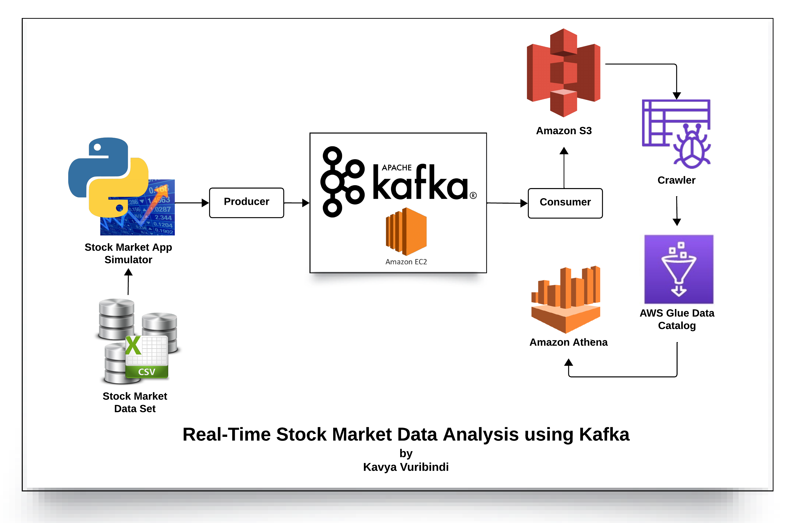

# Real-Time-Stock-Market-Data-Analysis-using-Kafka

## Introduction 
In this project, I've executed an End-To-End Data Engineering Project on Real-Time Stock Market Data using Kafka.

I've done data production, Kafka cluster setup, data consumption, storage in Amazon S3, building a data catalog, and data analysis using SQL with Amazon Athena.

## Architecture 

## Prerequisites:
**Hardware:** Laptop and stable internet connection.  
**Software:** Python with Jupyter Notebook installed.  
**Cloud Services:** AWS account for storing data in S3, hosting Kafka servers on EC2, running crawlers, and querying data with Amazon Athena.

## Technology Used
- Programming Language - Python
- Amazon Web Service (AWS)
1. EC2
2. S3 (Simple Storage Service)
3. Athena
4. Glue Crawler
5. Glue Catalog
- Apache Kafka

## Steps to Execute the Project:
**Setup Prerequisites:** Ensure we have the necessary hardware, software, and AWS account set up.  
**Data Production:** Use Python to produce stock market data.  
**Kafka Cluster Setup:** Set up a Kafka cluster on AWS EC2.   
**Data Consumption:** Consume data from the Kafka broker.  
**Data Storage:** Store the consumed data onto Amazon S3.  
**Data Catalog:** Crawl the stored data in S3 to build a data catalog.  
**Data Analysis:** Analyze the data using Amazon Athena and SQL queries.  

